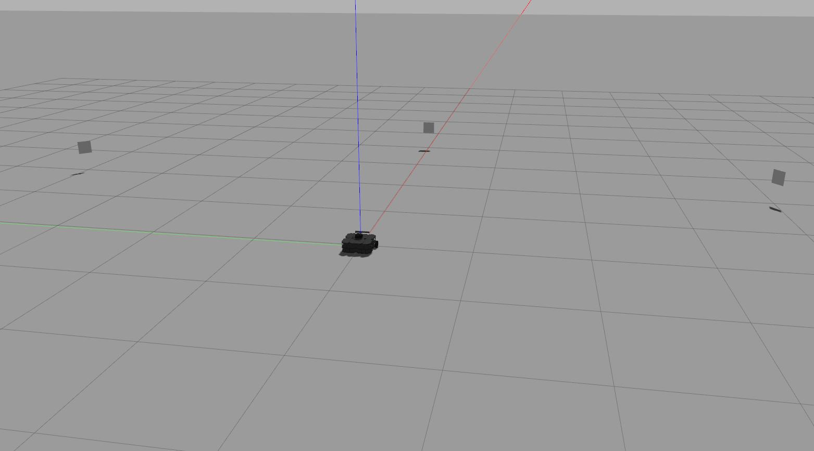

# rwa3_group
Baseline package for RWA3.

In the following instructions, we assume your catkin workspace is named enpm809e_ws and is located in your home directory.

- `cd ~/enpm809e_ws/src`
- `git clone https://github.com/zeidk/rwa3_group.git`
- `cd ~/enpm809e_ws`
- `rosdep install --from-paths ./src --ignore-packages-from-source -y`
- `catkin build`
- `source ~/enpm809e_ws/devel/setup.bash`
- Try `roscd rwa3_group` to make sure the package can be found.

The Gazebo world used in this package uses some custom models (ArUco markers) that can be found in the models folder. Tell Gazebo where to find these models by adding the following in your `.bashrc` (adapt this path to your case):
- `export GAZEBO_MODEL_PATH=/home/zeid/enpm809e_ws/src/rwa3_kootbally/models:$GAZEBO_MODEL_PATH`

We need the Waffle model for this assignment. Make sure you have the following line in `.bashrc`:
- `export TURTLEBOT3_MODEL=waffle`

Start the environment to make sure the ArUco markers appear in the environment.
- `roslaunch rwa3_group rwa3.launch`

Your environment should be similar as the one shown in the following picture (1 robot + 3 ArUco markers).

